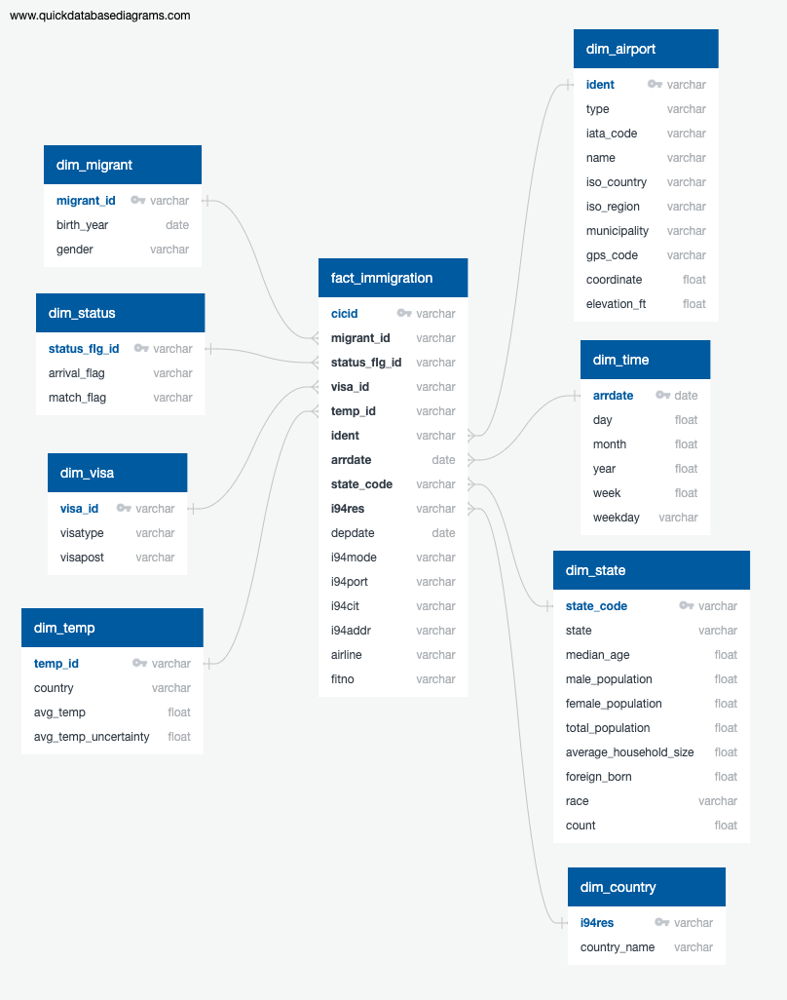
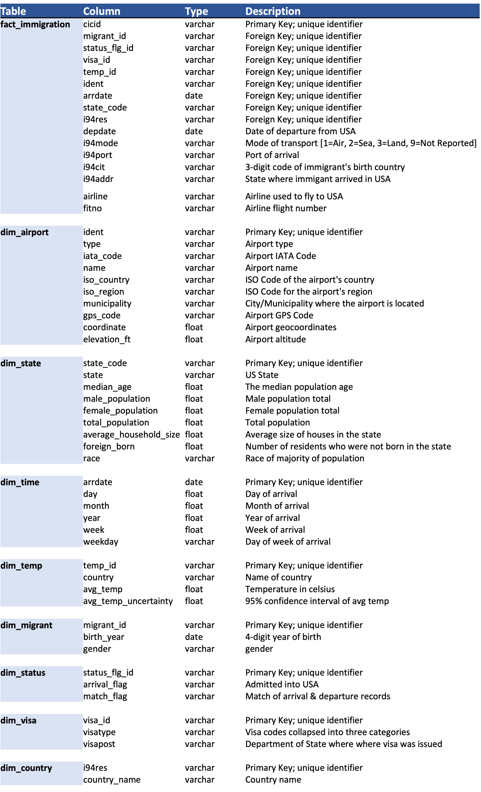

# Udacity Data Engineering Nanodegree | Capstone Project

## Description

Sparkify, A music streaming company, decided to use Apache Airflow to automate and monitor their ETL pipelines. Airflow enriches their ETL given it enables:
* Historical back-filling of data
* Reusable code to replicate, tweak, and apply to similar tasks eliminating verbosity  
* Orchestration monitoring to easily diagnose and debug failed steps of the automated orchestration

Source datasets are available as JSON logs in S3 and this Airflow-enabled ETL loads & processes this data in AWS Redshift.

---

## Project Files

    .
    │    
    ├── dags                            
    │   └── sparkify_dag.py             # Main DAG file with all imports, tasks, operators, and dependencies
    │
    │── plugins                         
    │   └── helpers                     
    │   │   └── sql_queries.py          # SQL syntax for inserting data into created tables
    │   └── operators                   
    │       ├── data_quality.py         # Class object that runs data quality checks 
    │       ├── load_dimension.py       # DAG Operator that loads data into dimension tables
    │       ├── load_fact.py            # DAG Operator that loads data into fact table
    │       └── stage_redshift.py       # Copies data from S3 to Redshift
    │    
    │── create_tables.py                # SQL syntax to create desired tables in Redshift
    │    
    ├── img                             # Images used in this ReadMe.md file
    │   └── ...                         # ...
    │    
    └── ReadMe.md                       # This ReadMe.md file

---

## Data Model & Dictionary

---

## ETL

The pipeline collects source data from 3 locations, processes it, and saves it as parquet files locally. Afterwards, the processed data is uploaded to Amazon S3. The pattern for processing each table is as follows:

1. Reading raw data
2. Transforming the data
3. Verifying the accuracy of the processed data
4. Saving the processed data in the output folder in parquet format

The project utilizes several tools, including:
- Apache Spark for processing large data sets
- Pandas for easily reading HTML tables
- Amazon S3 for scalable, reliable, fast, and cost-effective storage

Running the pipeline requires 2 further simple steps:
1. Configure the dl.cfg file, using an IAM User with only AmazonS3FullAccess policy for the KEY and SECRET fields and the S3 bucket name for the S3 field.
2. Head to the project's root directory and run the command `python -m etl`.

---

## Further Considerations

**1. Scaling the data** \
If the data volume was increased 100x and Spark is in standalone server mode we should consider using AWS EMR for distributed data processing on the cloud.

**2. A daily 7:00 AM SLA for a dashboard relying on this data** \
Apache Airflow could be used to build an ETL pipeline to regularly update the data and populate the dashboard. Apache Airflow is Python native and integrates well with AWS allowing for quick and easy orchestration.

**3. Database accessibility to over 100 people** \
AWS Redshift can handle up to 500 connections, making it a suitable solution for this requirement. However, a cost/benefit analysis should be conducted before implementing this cloud-based solution.

**4. Mismatch in timeframe across datasets** \
The immigration dataset is from 2016 while the last year in the temperature dataset is 2013 meaning the latter can't be used to observe temperature changes in 2016.

**5. Missing state & city data** \
The label description file is missing state and city information making it difficult to join immigration and demographic tables.